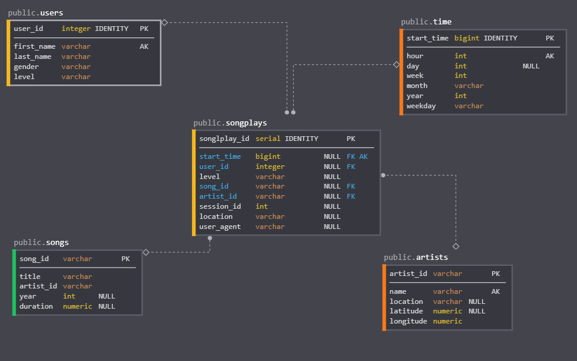

# Sparkify - Data Modeling with Postgres

### Udacity Data Engineer Nano Degree

## Introduction

This project involves creating and inserting music data into our Sparkify Database. Data is extracted from a collection of JSON files, which are then cleaned/injested 
using Python. Using the Python library Pandas, I was able to iterate through the collection of dataframes created from sub setting the JSON files and then store them 
into the Postgres tables which were created prior. The two sets of data used are from the [Million Song Dataset](http://millionsongdataset.com/) and the [Event Simulator](https://github.com/Interana/eventsim)
you can read more from the links provided. 

The purpose of this demo was to provide the analysts of Sparkify a way to query their information in a precise way, specifically finding out what songs users are currently listening to. 

## The ETL Pipeline

Above you will see the data model I created for Sparkify. This model has 5 different tables associated with it, one of which is a fact table called *songplays*. The rest of the tables that make up this model are all dimension tables (*users*, *songs*, *artists*, and *time*). 

## What you need.
You'll need a certain level of Python.3x installed and the *Python* libraries *Pandas*, *Numpy*, *psycopg2*, as well as *Postgres* on your computer.

